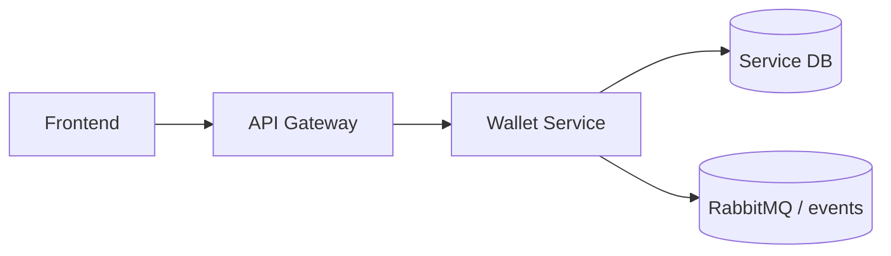

# Software Architecture

## Responsibility

Wallet provisioning, top-up intent, payment reconciliation, withdrawal, bid holds, hold release/convert, seller escrow, payout, and duplicate callback/idempotency protection.

## Integration Surface

`/api/v1/wallet/**`, top-up intent, payment reconciliation, hold/release/convert, seller escrow, payout, withdrawal, provisioning consumer.

## Platform Position

## State and Consistency

Wallets, transactions, holds, payment intents, withdrawals, and provisioning events are persisted through SQLx. Idempotency uses correlation IDs/source service fields.

## Cross-Service Contract

The gateway and event bus are the only supported cross-service entry points. Downstream consumers must tolerate additive optional fields, while existing required fields and routing keys remain stable.
