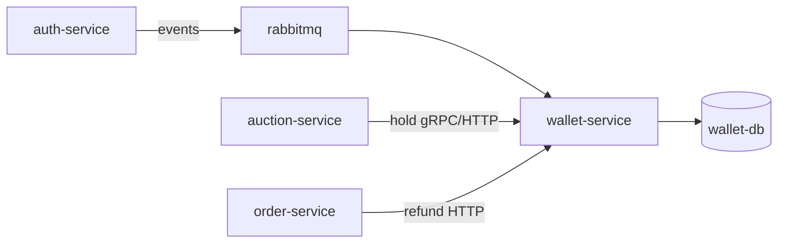

# Software Architecture

## Integrations

| System | Protocol | Code |
|--------|----------|------|
| Auth | RabbitMQ `WalletProvisionRequested` | `messaging/provisioning_consumer.rs` |
| Auction | HTTP + gRPC holds | `http/router.rs`, `grpc/mod.rs` |
| Order / disputes | HTTP refund/release | wallet client from order service |
| Midtrans | HTTPS Core + IRIS | `payment/mod.rs` |
| PostgreSQL | SQLx | `persistence/` |

## Financial consistency

- Holds reserve balance before auction bid persistence (auction calls wallet first).
- `reconciliation.rs` supports operational balance checks.
- Transactions recorded in `wallet_transactions` with typed `TransactionType`.

## Networking

- North-south: REST via gateway port 8083.
- East-west: gRPC `50051` for low-latency auction path (`WALLET_GRPC_URL` in auction compose).

## Metrics

- `/metrics` Prometheus exposition on HTTP router.
- Scraped as `bidmart-wallet-service` in platform Prometheus config.
